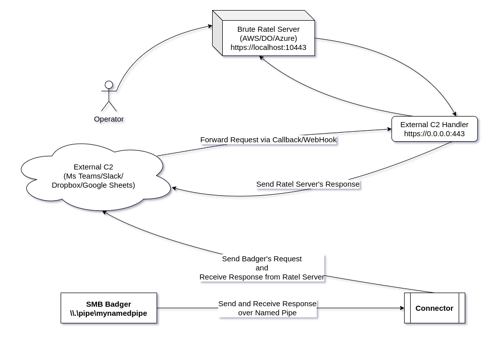

# Brute Ratel External C2 Specification

The core logic behind using an External C2 is to hide your payload output inside legitimate network traffic. This can be done in numerous ways using fronted domains, Dns Over Https or known redirectors such as aws/azure. However sometimes they are not enough. Sometimes you need something more subtle so that you can camouflage yourself into the existing traffic of your organization. The External C2 Specification provides a breakdown of the basic fundamentals towards building your own External C2. The repository contains the core logic and code in C to build your External C2 Connector and Server. Below are a few points worth noting before building your Connector and the Server

- SMB or TCP badgers can be used to interact with your External C2 Servers. The current example uses SMB badger
- This example connects to the badger on the named pipe `\\.\pipe\mynamedpipe` which is fully configurable via badger's [Payload Profile](https://bruteratel.com/tabs/ratelwarroom_features/ratel-server/payload-profiler/#profile-ratel)
- All badgers return output which is encrypted and then encoded in base64
- The aim is to read this output and reroute it to wherever the operator needs it to; for example Slack, MS Teams Channel, Dropbox or even sending data inside an Image blob to file hosting websites, etc.
- The connector provided in the example reads and writes buffer to the SMB named pipe. It is the duty of the operator to write the remaining logic of forwarding it to their own External C2 Server.
- One more important thing to note is to make sure the BRc4 Ratel Server receives the full response, as-is from the External C2 Server. This means if the badger returns an encrypted-encoded output of 10000 bytes, then it should be sent as-is to BRc4's HTTPS Server. The output cannot be in parts because the Ratel Server is only responsible for receiving the whole output, decrypting the output and sending a response back.
- The user is responsible to write a Handler and a Connector which does the following:
  -  Connector:
    - Receive SMB Output from the SMB/TCP Badger (current example uses SMB badger)
    - Forward the response to External C2 Server
    - If the External C2 accepts only a limited number of bytes, the user will have to split the buffer into multiple chunks and send it to the server
    - The External C2 Server should either support Webhooks which can forward these chunks to an External C2 Handler Controlled by the User, or the External C2 Handler will have to read this from the External C2 Server
    - The External C2 Handler should receive the chunked buffer from the Server, combine all the responses and send it to the Ratel Server
    - The External C2 Handler will also have to receive a response from the Ratel Server and forward it to the External C2 Server. If the response from the Ratel Server is more then the limited number of bytes the External C2 Server can accept, the the External C2 Handler will have to split it in chunks and send it to the External C2 Server
    - The badger then has to read this response sent to the External C2 Server and forward it to the SMB badger
- If there is no response received from the External C2 Server, then the connector has to send a single byte "" to our named pipe to let the named pipe know that there is no response yet and then continue listening on the named pipe
- Badger will frequently send a request on the named pipe every 2 second which is the default sleep cycle unless changed
- External C2 connectors and servers can be written in any language. The current example uses C language since it's easy to convert the connector to a PIC as explained in my blog [here](https://bruteratel.com/research/feature-update/2021/01/30/OBJEXEC/)

##  Graphical Overview

